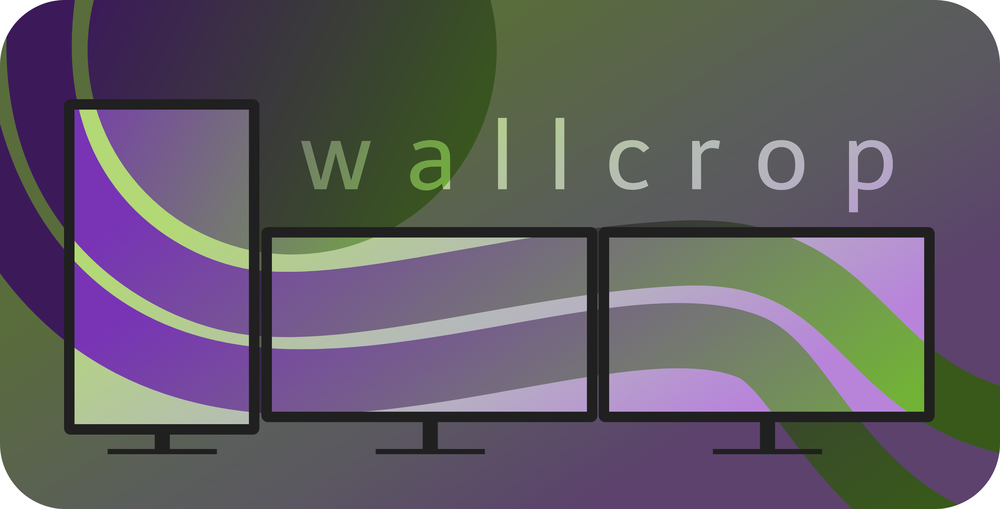

# Wallcrop



Wallcrop is a simple tool for cropping an image into smaller images for use as individual desktop wallpapers in a multi-monitor setup.

It can either arrange by size in pixels, or by the actual size of the monitors in cm.

## Installation:

The easiest way to install would be using `pip` in a virtual environment:

```bash
python -m venv venv
source venv/bin/activate
pip install wallcrop
```

## Usage

In order to crop up some images you need to let wallcrop know about your monitor setup. This is done in a yaml file, here called `monitors.yml`, an example for this file can be found in `examples/monitors.yml`.

The `monitors.yml` contains a list of monitors, each with a `name`, `height` and `width` of the monitor (if your monitor is vertical just swap these) and `x` and `y` position of the top left corner of the monitor in pixels.
If you want to use the `actual-monitor-size` (`-a`) option (arranging not by the size in pixels, but the actual size of the screens in cm) you need to additionally add values for `x_cm`, `y_cm`, `width_cm` and `height_cm` for each monitor, in that case you don't need values for `x` and `y`. Gaps between monitors should be accounted for in `x_cm` and `y_cm`.

In the used coordinate system $x=0$, $y=0$ is the top-left corner, with x increasing to the right, and y increasing down. negative values for these are also fine.

### Cropping Images

To crop an image use:

```bash
wallcrop -m path/to/your/monitors.yml path/to/your/image.png
```

To crop all images in a folder use:

```bash
wallcrop -m path/to/your/monitors.yml path/to/your/images/*
```

**New: Manual Crop Offset**
To manually specify the top-left corner of your monitor layout within the image (overriding automatic centering), use the `--offset X,Y` option:

```bash
wallcrop -m monitors.yml image.png --offset 100,50
```

### Creating `monitors.yml`

You can now automatically generate a `monitors.yml` file from your Hyprland setup using `hyprctl monitors -j`.

```bash
wallcrop -c
```

By default, this will create `monitors.yml` with `x_cm` and `y_cm` set to 0.0. You can use the `--align` option for automatic physical alignment:

```bash
# For a vertical stack of monitors, centered horizontally:
wallcrop -c --align vertical

# For a horizontal row of monitors, centered vertically:
wallcrop -c --align horizontal
```
For more options see

```bash
wallcrop -h
```

## wallswitch

as a treat, there also is wallswitch for setting the wallpapers following the wallcrop structure. this currently only supports `swww` and `hyprpaper` (using preload`hyprctl hyprpaper` for IPC) as wallpaper daemons and only works if the names of the monitors in the `monitors.yml` correspond to the names of the outputs

## Wallcrop GUI (Experimental)

A graphical user interface for `wallcrop` is now available, allowing for visual cropping and easier management.

To launch the GUI:

```bash
wallcrop-gui
```

**Features:**
*   **Visual Overlay:** See a real-time overlay of your monitor layout on the selected image.
*   **Interactive Cropping:** Drag the overlay to precisely position your crop. The current offset is displayed dynamically.
*   **Scale Simulation:** The overlay adjusts its size to simulate how `wallcrop` scales images that are smaller than your monitor setup.
*   **Monitor Configuration:** Automatically loads `monitors.yml` from the image's directory or a previously saved default location. You can also manually load a `monitors.yml` file.
*   **Persistence:** Remembers your last loaded `monitors.yml` for convenience.
*   **Keyboard Shortcuts:**
    *   `Ctrl+O`: Open Image
    *   `Ctrl+S`: Crop & Save